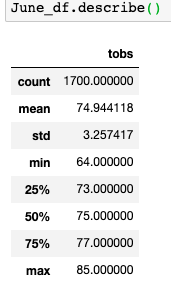
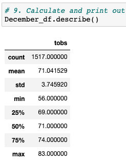

# Surfs Up Challenge
Author: Jerome Simmons

## Overview of the Analysis
Our client, W. Avy would like to understand the temperatures experienced in Oahu, Hawaii in order to determine whether or not his surf and ice cream shop is sustainable year round. We have been asked to provide summary statistics on seven years of temperature observations for the months of December and June. We have determined that temperature data suggests that the ice cream & surf shop is sustainable year round, and explain our conclusion in the results and summary sections below.

## Results
We have analyzed the temperature observations in June and December over the past seven years and determined that these months are relatively close in terms of average temperature. Although December has more cold days and a wider range of temperature values, the temperature observations would not be a major deterrent for customers interested in surfing and ice cream. We have provided three key insights based on our summary statistical analysis shared in the sections below.
1. On average, temperatures are 3.9 degrees higher in June than in December (74.94 vs 71.04 degrees).
2. December temperatures have a wider range of cold values compared to June. The standard deviation of temperatures in December is 3.75 degrees versus 3.26 degrees in June.
3. December temperatures can be significantly colder than June temperatures. The coldest temperatures in December (56 degrees) are 12% colder than the coldest day in June (64 degrees).

### June Summary Statistics
We have 1,700 temperature observations during the month of June (2017 - 2018). The average temperature was 74.94 degrees with a standard deviation of 3.26 degrees.  Over 67% of our temperature observations fell between 78.2 and 71.7 degrees for the month of June. Given the median is 75 degrees, the temperature data is normally distributed.

### December Summary Statistics
We have 1,517 temperature observations during the month of December (2017 - 2018). The average temperature was 71.04 degrees with a standard deviation of 3.75 degrees.  Over 67% of our temperature observations fell between 74.8 and 67.3 degrees for the month of December. Given the median is 71 degrees, the temperature data is also normally distributed but slightly more disbursed compared to June. The coldest temperature observed was only 56 degrees.

## Summary
Based on the results above, the weather in Oahu, Hawaii is relatively similar in June as it is in December. Although there is some variance in temperature observations, the variance is minimal and seasonal temperature does not pose a significant risk to the purchasing behavior of our customer base. Based on the temperature data, we feel confident that the surf and ice cream shop will remain in business year round.

However, there are additional areas of analysis that we should consider in order to gain more confidence in the investment decision. We would recommend reviewing
1. Precipitation levels year round to determine risks associated with rainy seasons that may deter surfing behavior and ice cream purchases;
2. Temperature levels year round to determine any further risks associated with extremely warm or cold temperatures;
3. Tourist and local migration trends to determine any risks associated with our intended customer base.
